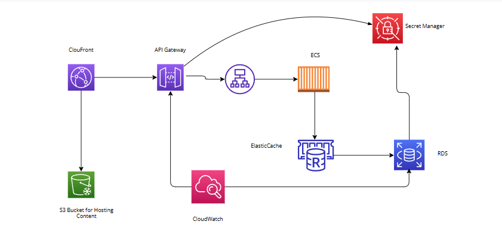

# Microservices Infrastructure on AWS with Terraform

## Overview

This project sets up a scalable, fault-tolerant, and secure infrastructure for a microservice-based architecture on AWS. The infrastructure is provisioned using Terraform, ensuring consistency, modularity, and automation. The system supports frontend, backend, API integrations, database, and caching microservices with built-in monitoring, logging, alerting, and security features.

---

## Features

1. **High Availability**: Services are deployed across multiple Availability Zones.
2. **Fault Tolerance**: ECS services and RDS instances are monitored and automatically restarted upon failure.
3. **Scalability**: Auto Scaling is configured for ECS tasks and database read replicas.
4. **Load Balancing**: Application Load Balancer (ALB) ensures even distribution of traffic.
5. **Self-Healing**: Health checks automatically recover failed instances.
6. **Monitoring and Logging**: AWS CloudWatch for centralized logging and metrics.
7. **Security**: Managed secrets, strict IAM policies, and network security with private subnets.
8. **Caching**: ElastiCache (Redis) improves database query performance.

---

## Architecture Diagram



---

## Components

### AWS Services

- **Frontend**: Hosted on S3 and delivered via CloudFront .
- **Backend**: Deployed on Amazon ECS (Fargate) to ensure scalability and containerized management.
- **API Integration**: Managed via API Gateway for unified API entry points.
- **Database**: Amazon RDS (MySQL) for relational data storage in a secure and highly available setup.
- **Caching**: Amazon ElastiCache (Redis) for faster data retrieval.
- **Secrets Management**: AWS Secrets Manager for secure storage of sensitive data.

### Tools Used

- **Terraform**: Infrastructure as Code (IaC) to define and provision AWS resources.
- **AWS CloudWatch**: For monitoring, logging, and alerting.
- **AWS IAM**: For fine-grained access control and secure resource management.

---

## Prerequisites

1. AWS account with appropriate permissions.
2. Terraform installed locally (v1.5 or later recommended).
3. AWS CLI configured with your credentials.
4. Docker (for containerized application testing, optional).

---

## Setup Instructions

### Clone the Repository

```bash
git clone https://github.com/your-github-username/microservice-infra-aws-terraform.git
cd microservice-infra-aws-terraform
```

### Terraform Workflow

Basic Terraform commands to manage the infrastructure.

## Prerequisites

1. Install [Terraform](https://www.terraform.io/downloads.html) on your system.

### Configure your AWS CLI:

```bash
aws configure
terraform init   (This command initializes the Terraform working directory)
terraform plan    (Generate an execution plan to see what changes Terraform will make)
terraform apply   (Apply the changes defined in the plan)
terraform destroy  (If you want to tear down the infrastructure, run)
```
